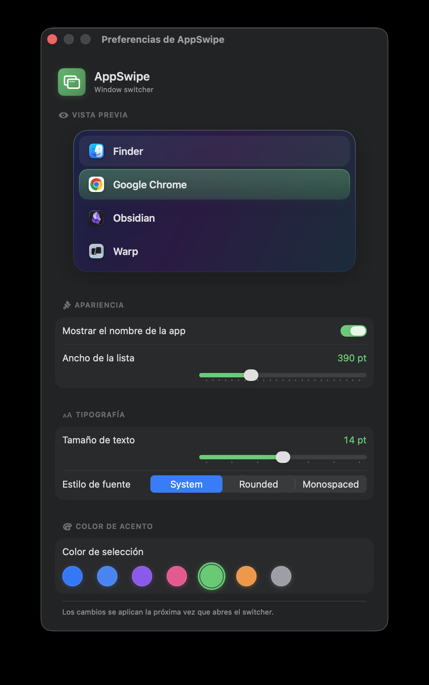
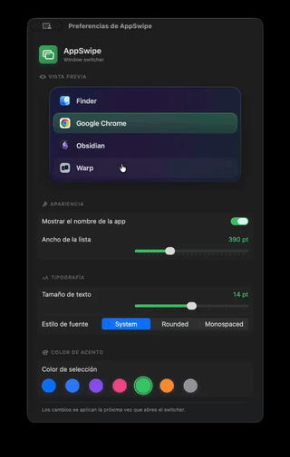

<div align="center">

# 🪟 AppSwipe

**A fast, minimal, native macOS window switcher.**

Replace ⌘-Tab with a clean, glassy list of your *windows* — not just apps.

[](https://www.apple.com/macos/)
[](https://swift.org)
[](https://developer.apple.com/xcode/swiftui/)
[](LICENSE)


<br/>



</div>

---

## 💡 Why

macOS's built-in ⌘-Tab switches between *apps*. **AppSwipe switches between *windows***, in true most‑recently‑used order — so flipping between your last two windows is instant, even when they belong to the same app. No live thumbnails (those need private APIs); just a crisp **icon + title** list that feels native and gets out of your way.

## ✨ Features

- ⌨️ **⌘-Tab to switch windows** — hold ⌘, tap Tab to cycle, release to select (⌘⇧Tab goes back).
- 🔁 **True MRU order** — alternate between your two last windows like ⌘-Tab, regardless of app.
- 🪟 **Native Liquid Glass** — built on macOS Tahoe's `NSGlassEffectView`.
- ⚡ **Instant quick-switch** — a fast tap-and-release switches with no UI; hold to reveal the list.
- 🖱️ **Mouse or keyboard** selection, with hover feedback.
- 🎨 **Live preview** in Preferences — change size, font and accent color and see it update instantly.
- 📊 **Menu-bar item** with Preferences and Quit.
- 🔒 **100% public macOS APIs** for window data + Accessibility — no Screen Recording needed.

## 🎬 Demo

<div align="center">



<sub>⌘-Tab switching, live preview and accent colors in action.</sub>

</div>

## 📦 Install (beta — build from source)

```bash
git clone https://github.com/stivenrosales/AppSwipe.git
cd AppSwipe
./scripts/run.sh
```

`run.sh` builds a release, installs **AppSwipe.app** into `/Applications`, signs it with a stable local certificate (so the Accessibility permission survives rebuilds), and launches it. Then grant **Accessibility** in *System Settings → Privacy & Security → Accessibility*.

> ⚠️ AppSwipe is signed with a *local self-signed* certificate, not an Apple Developer ID. macOS Gatekeeper may warn on first open — right-click the app → **Open** to confirm. A notarized release will come later.

## 🛠️ Building & developing

This project uses **Swift Package Manager**, driven through a `Makefile`:

```bash
make build     # debug build
make test      # run the domain test suite (Swift Testing)
make release   # release build
```

<details>
<summary><b>macOS Tahoe build note</b></summary>

On macOS 26 **Command Line Tools**, plain `swift build` fails to compile the package manifest (a symbol mismatch in `libPackageDescription`, `SwiftVersion` vs `SwiftLanguageMode`). The `Makefile` + `scripts/swift-wrapper.sh` work around this transparently — **always build via `make`, never `swift` directly.**
</details>

## 🏗️ Architecture

Clean and layered, with a pure, fully-tested core:

| Layer | What |
|---|---|
| **`AppSwipeCore`** | Pure domain: window model, MRU tracker, selection logic. No AppKit/SwiftUI. Unit-tested. |
| **`AppSwipe`** | System adapters (window enumeration, activation, the ⌘-Tab `CGEventTap`, permissions) + SwiftUI presentation + composition root. |

The domain depends on protocols (ports); the macOS adapters implement them — so the switching logic is tested without ever opening a window.

## ☕ Support the creator

AppSwipe is free. If it makes your day a little smoother, you can buy me a coffee:

**PayPal:** `stivenrosales01@gmail.com`

Every coffee fuels the next feature. Thank you! 🙌

## 🗺️ Roadmap

- [ ] Type-to-filter the window list
- [ ] Close a window straight from the switcher
- [ ] Launch at login
- [ ] Configurable shortcut
- [ ] Notarized signed release

## 📄 License

[GPL-3.0](LICENSE) © Stiven Rosales — free to use, study, modify and share. Forks must stay open source under the same license.

---

<div align="center">
<sub>Beta software, provided as-is. AppSwipe uses the Accessibility API to read and activate your windows — nothing ever leaves your machine.</sub>
</div>
